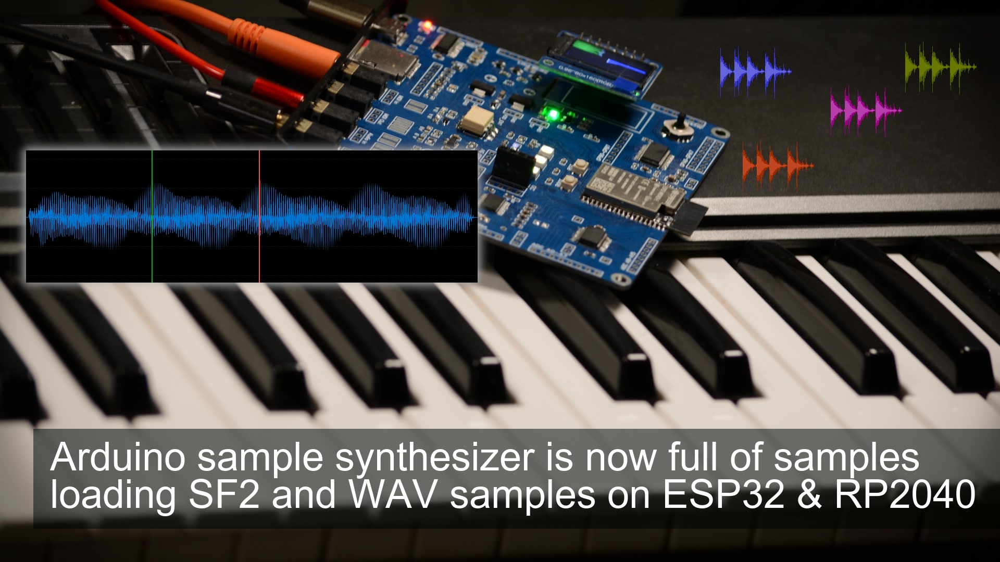

<h1 align="center">ml_synth_sampler_example</h1>
<h3 align="center"Arduino synthesizer sampler with loader for wav and sf2 soundfont files</h3>  

 
   
  <a href="https://youtu.be/G6Go3KIiWPE">link to the video ESP32</a>

The required library can be found here: https://github.com/marcel-licence/ML_SynthTools
Version 1.2.0 will be required (will be released soon)

Supported versions of board library
---
This project is an example supporting the following platforms:
- ESP32, RP2040: for more details look <a href="doc/board_info.md">here</a>

I would recommend to take a look at the loaddata_examples.ino
Here you would find different possibilities to load data into the sampler:
- single wav file to preset (all keys used for playback of the same sample with different pitch)
- wav files to different keys (each key can playback another sample)
- folder to different keys (wav files contained in a folder mapped to different keys)
- folder to presets (each file found in a folder will be used as a new sound)
- samples from soundfont (ignoring the rest within the soundfont the samples only will be loaded)
- instruments from soundfont (this allows to get key mapping: notes and velocity)
- load complete soundfont (the sample data will be copied completely and loading the properties)

Some features of soundfonts are not supported (like modulators etc.)

More information will be available in future

## download & compile
### Step 1: Download and Install ML_SynthTools and ML_SynthTools_Lib
- Navigate to the **ML_SynthTools** GitHub repository: [ML_SynthTools](https://github.com/marcel-licence/ML_SynthTools)
  and follow the instructions
- Navigate to the **ML_SynthTools_Lib** GitHub repository: [ML_SynthTools_Lib](https://github.com/marcel-licence/ML_SynthTools_Lib)
  and follow the instructions
### Step 2: Download the Arduino project
- Navigate to the **ml_synth_sampler_example** GitHub repository: [ml_synth_sampler_example]([https://github.com/marcel-licence/ML_SynthTools](https://github.com/marcel-licence/ml_synth_sampler_example).
- Click the green **Code** button and select **Download ZIP**.
- Extract the contents of the zip-archive to a directory of your choice
### Step 3: Open the project
- locate **ml_synth_sampler_example.ino** in your project folder and open it within the Arduino IDE
### Step 4: Choose your configuration
- This project might be compatible for different configurations. You could choose the ESP32 in your board manager as an example. Compatible and tested configurations are listed here: [board_info](doc/board_info.md)
### Step 5: Run the compilation
- You can run the compiler
### Step 6: Upload the firmware
- Finally, you can upload the firmware
### Step 7: Check your hardware configuration
- It is higly recommended to open the serial monitor. It displays some pin settings for different components like the audio codec and other used pins
